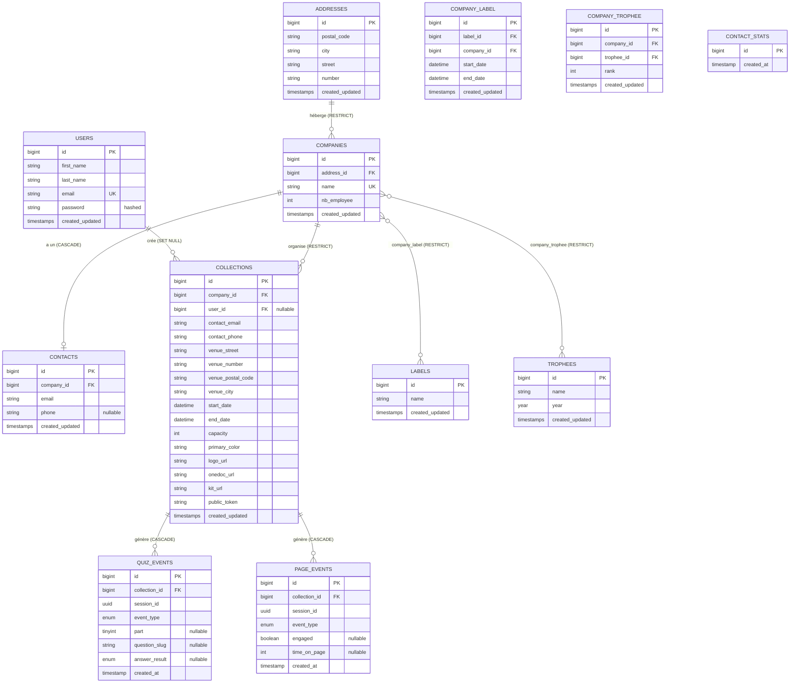

# Rapport technique — Plateforme Ligtile (collectes de sang CTS / HUG)

> **Périmètre de ce document.** Cette partie du rapport se concentre sur les aspects **techniques** du projet : le **modèle de données**, l'**architecture du code** et les **choix d'organisation et de gestion de projet sur GitHub**. La description fonctionnelle du produit (parcours utilisateur, justification des fonctionnalités) est traitée séparément par un autre membre de l'équipe.
>
> Sauf mention contraire, tous les extraits de code sont cités avec leur fichier source et leurs numéros de ligne, afin d'être facilement retrouvés dans le dépôt GitHub auquel les enseignants ont accès.

---

## Table des matières

1. [Contexte technique et stack](#1-contexte-technique-et-stack)
2. [Modèle de données](#2-modèle-de-données)
   - 2.1 [Vue d'ensemble](#21-vue-densemble)
   - 2.2 [Diagramme UML / entité-relation complet](#22-diagramme-uml--entité-relation-complet)
   - 2.3 [Description des tables](#23-description-des-tables)
   - 2.4 [Choix de conception notables](#24-choix-de-conception-notables-et-justifications)
3. [Architecture du code](#3-architecture-du-code)
   - 3.1 [Vue globale de l'arborescence](#31-vue-globale-de-larborescence-du-projet)
   - 3.2 [Architecture back-end](#32-architecture-back-end-laravel)
   - 3.3 [Architecture front-end](#33-architecture-front-end-vue-3)
   - 3.4 [Choix d'architecture spécifiques](#34-choix-darchitecture-spécifiques-et-justifications)
4. [Gestion de projet et GitHub](#4-gestion-de-projet-et-github)

---

## 1. Contexte technique et stack

La plateforme est une application web **multi-sites** permettant au CTS (Centre de Transfusion Sanguine, ici une instance fictive rattachée aux HUG de Genève) d'organiser des collectes de sang en entreprise. Elle se décompose en **trois espaces** servis par une seule et même application :

- le **site public** vitrine (`/`) ;
- le **dashboard CTS** protégé (`/dashboard`) ;
- les **sites cobrandés** générés automatiquement pour chaque collecte (`/{token}`).

Le projet repose sur une architecture **API REST + SPA découplée**, choisie pour réutiliser les acquis des cours (Laravel et Vue) plutôt que d'introduire un nouveau framework.

| Couche | Technologie | Version |
|--------|-------------|---------|
| Back-end | Laravel / PHP | Laravel 13.8, PHP 8.4 |
| Authentification | Laravel Sanctum (mode cookie stateful) | 4.0 |
| Front-end | Vue 3 (Composition API) | 3.5 |
| Build / bundler | Vite + `laravel-vite-plugin` | Vite 8 |
| Styling | Tailwind CSS | 4.0 |
| Base de données | SQLite (dev) / MariaDB (prod) | — |
| Qualité | Pint (PHP), ESLint + Prettier (JS) | — |
| CI/CD | GitHub Actions | — |
| Hébergement | Infomaniak (déploiement SSH) | — |

*Sources : [composer.json:11-27](composer.json), [package.json:13-29](package.json).*

---

## 2. Modèle de données

### 2.1 Vue d'ensemble

Le modèle de données s'organise autour de quatre domaines :

1. **Domaine métier « entreprises »** — `addresses`, `companies`, `contacts`, ainsi que les labels et trophées attribués aux entreprises (`labels`, `trophees`) via des tables pivot (`company_label`, `company_trophee`).
2. **Domaine métier « collectes »** — la table centrale `collections`, reliée à une entreprise et (optionnellement) à un utilisateur CTS.
3. **Domaine « tracking »** — `quiz_events` et `page_events`, qui enregistrent de manière anonyme le comportement des employés sur les sites cobrandés, plus `contact_stats` pour le comptage des demandes.
4. **Domaine « administration / framework »** — `users` (comptes CTS), et les tables techniques de Laravel (`sessions`, `cache`, `jobs`, `password_reset_tokens`).

L'ensemble du schéma est défini par des **migrations Laravel** versionnées dans `database/migrations/`, et les relations sont déclarées via **Eloquent** dans `app/Models/`.

### 2.2 Diagramme UML / entité-relation complet

Le diagramme ci-dessous est fourni en **Mermaid** (syntaxe `erDiagram`) afin de pouvoir être importé directement dans Figma via un plugin Mermaid, ou rendu tel quel par GitHub/Notion. Il couvre l'intégralité des tables métier et de tracking, avec leurs cardinalités et le comportement des clés étrangères à la suppression (`RESTRICT`, `CASCADE`, `SET NULL`).



> **Note de lecture.** Les deux tables pivot `COMPANY_LABEL` et `COMPANY_TROPHEE` matérialisent les relations *many-to-many* `COMPANIES ⇄ LABELS` et `COMPANIES ⇄ TROPHEES`. Elles sont représentées comme entités dans le diagramme car elles **portent des attributs propres** (dates de validité du label, rang du trophée), ce qui n'est pas un simple pivot anonyme.

### 2.3 Description des tables

#### Domaine « entreprises »

- **`addresses`** — adresse postale (NPA, ville, rue, numéro). Le NPA et le numéro de rue sont stockés en chaîne pour ne pas perdre les zéros initiaux et accepter les formats suisses. Référencée par `companies`.
- **`companies`** — entreprise partenaire : `name` (unique), `nb_employee`, et FK vers `addresses`. Le modèle expose un **attribut calculé** `size_label` qui catégorise l'entreprise selon son effectif :

```php
public function getSizeLabelAttribute(): string
{
    return match (true) {
        $this->nb_employee >= 1000 => 'Grande entreprise',
        $this->nb_employee >= 500  => 'Moyenne entreprise',
        $this->nb_employee >= 100  => 'Petite entreprise',
        default                    => 'Très petite entreprise',
    };
}
```
*Légende : [app/Models/Company.php:24-32](app/Models/Company.php).*

> **Seuil métier.** Le seuil de 1000 employés n'est pas arbitraire : il sépare les **grandes entreprises**, pour lesquelles le CTS organise une collecte dédiée sur place, des **plus petites**, auxquelles le CTS réserve des créneaux dans une collecte publique existante. Cette catégorie pilote notamment les messages d'aide affichés au CTS dans le formulaire de création de collecte (champ capacité, lien Onedoc).

- **`contacts`** — coordonnées de contact d'une entreprise (relation `hasOne`).
- **`labels`** / **`company_label`** — il existe un **unique label CTS** ; la pivot `company_label` enregistre les **périodes successives** de labellisation d'une entreprise (`start_date` → `end_date`). Une entreprise peut donc avoir **plusieurs lignes** (un historique) : aucune contrainte d'unicité `(label_id, company_id)` n'est posée. La logique d'attribution est détaillée en [§2.4 i](#24-choix-de-conception-notables-et-justifications).
- **`trophees`** / **`company_trophee`** — trophées annuels attribués aux entreprises avec un `rank` (pour le podium du site public), uniques sur `(company_id, trophee_id)`.

#### Domaine « collectes »

- **`collections`** — table centrale. Une collecte appartient à une `company` et, optionnellement, à l'`user` CTS qui l'a créée. Elle agrège trois groupes d'informations : **logistique** (`venue_*`, `start_date`, `end_date`, `capacity`), **co-branding** (`primary_color`, `logo_url`), et **liens externes** (`onedoc_url`, `kit_url`, `public_token`).

```php
$table->foreignId('company_id')->constrained()->restrictOnDelete();
$table->foreignId('user_id')->nullable()->constrained()->nullOnDelete();
$table->string('contact_email', 100);
// ...
$table->datetime('start_date');
$table->datetime('end_date');
$table->integer('capacity');
$table->string('primary_color');
$table->string('logo_url');
$table->string('onedoc_url');
$table->string('kit_url');
$table->string('public_token');
```
*Légende : [database/migrations/2026_05_26_131534_collections.php:16-31](database/migrations/2026_05_26_131534_collections.php). `contact_phone` (non montré) est `NOT NULL` — il est obligatoire dans le formulaire de création.*

#### Domaine « tracking »

- **`quiz_events`** — un événement par interaction de l'employé avec le quiz d'éligibilité. Le champ `event_type` est un **ENUM** de neuf valeurs, et un **index composite** `(collection_id, event_type, session_id)` accélère les agrégations du dashboard.

```php
$table->foreignId('collection_id')->constrained()->cascadeOnDelete();
$table->uuid('session_id');
$table->enum('event_type', [
    'quiz_started', 'question_answered', 'question_skipped',
    'form_skipped_from', 'p1_eliminated', 'p1_completed',
    'p2_completed', 'quiz_completed', 'onedoc_clicked',
]);
$table->tinyInteger('part')->nullable();
$table->string('question_slug')->nullable();
$table->enum('answer_result', ['correct', 'incorrect'])->nullable();
$table->timestamp('created_at')->useCurrent();
$table->index(['collection_id', 'event_type', 'session_id']);
```
*Légende : [database/migrations/2026_06_01_223000_create_quiz_events_table.php:13-24](database/migrations/2026_06_01_223000_create_quiz_events_table.php).*

- **`page_events`** — engagement sur la page de prévention (scrollytelling) : `prevention_entered` / `prevention_exited`, avec `engaged` (l'utilisateur a-t-il interagi ?) et `time_on_page` renseignés à la sortie.
- **`contact_stats`** — table volontairement **minimale** (un `id` et un `created_at`) : elle ne sert qu'à compter les demandes de collecte (voir [§2.4](#24-choix-de-conception-notables-et-justifications)).

### 2.4 Choix de conception notables (et justifications)

Cette section ne décrit pas ce qui découle naturellement d'un schéma relationnel, mais **les décisions qui ont demandé un arbitrage de notre part**.

#### a) `contact_stats` : ne pas persister les données personnelles des formulaires

C'est le choix le plus structurant du modèle. Les **deux formulaires de contact** du site public collectent des **données personnelles**, variables selon le formulaire : nom d'entreprise et email dans les deux cas, complétés par le téléphone et l'adresse pour le formulaire détaillé, ou par un message libre pour le formulaire simplifié. Plutôt que de les stocker en base, le contrôleur les **valide**, les **transmet par email** au CTS (et un email de confirmation à l'expéditeur), puis n'enregistre **qu'une ligne vide** dans `contact_stats` :

```php
$validated = $request->validate([ /* … email, company_name, phone, address … */ ]);

try {
    ContactStat::create([]);                               // ← seul le compteur est persisté
    Mail::to('contact@hug-collecte.ch')->send(new ContactMail($validated));
    Mail::to($validated['email'])->send(new ContactConfirmationMail($validated));
    // …
```
*Légende : [app/Http/Controllers/Api/v1/ContactController.php:17-30](app/Http/Controllers/Api/v1/ContactController.php).*

**Pourquoi ?** Le seul besoin métier en base est le **KPI « nombre de demandes de collecte »** — un comptage daté suffit. Ne pas stocker les données personnelles élimine de fait toute obligation de conservation/suppression au sens nLPD/RGPD, et réduit la surface d'exposition. Le CTS travaille de toute façon depuis sa boîte mail pour le suivi des demandes. La table ne contient donc qu'un horodatage, sur lequel le dashboard filtre par année.

#### b) Dénormalisation du lieu de collecte (`venue_*`) plutôt qu'une FK vers `addresses`

`collections` **duplique** les champs d'adresse (`venue_street`, `venue_number`, `venue_postal_code`, `venue_city`) au lieu de pointer vers la table `addresses`. **Pourquoi ?** Le **lieu d'une collecte n'est pas l'adresse du siège de l'entreprise** : une même entreprise peut organiser des collectes sur différents sites, et l'adresse de collecte est une donnée figée dans le temps (elle ne doit pas changer si l'entreprise déménage). De même, `contact_email` / `contact_phone` sont portés par la collecte car le référent d'une collecte peut différer du contact général de l'entreprise. La dénormalisation est ici un choix assumé d'**immuabilité historique** et de découplage.

#### c) Comptage des inscrits calculé, et non stocké (`nb_registered` supprimé)

Il n'existe **aucune colonne `nb_registered`** sur `collections`. Le nombre d'inscrits est **dérivé dynamiquement** des événements `onedoc_clicked`, dédupliqués par session :

```php
$nbInscrits = $collection->quizEvents()
    ->where('event_type', 'onedoc_clicked')
    ->distinct()
    ->count('session_id');
```
*Légende : [app/Http/Controllers/Api/v1/CobrandController.php:23-26](app/Http/Controllers/Api/v1/CobrandController.php).*

**Pourquoi ?** Comme il n'y a pas d'intégration à l'API Onedoc (un clic sur le lien = une inscription), la seule source de vérité fiable est le tracking. Stocker un compteur dénormalisé aurait introduit un risque d'incohérence (compteur à maintenir à chaque événement). Le calcul à la volée garantit que la valeur affichée correspond toujours exactement aux événements enregistrés.

#### d) `public_token` plutôt que l'`id` numérique dans l'URL cobrandée

Le site cobrandé est résolu par un **token opaque** (`public_token`) et non par l'`id` auto-incrémenté de la collecte. **Pourquoi ?** Un `id` séquentiel serait **énumérable** : n'importe qui pourrait parcourir `/1`, `/2`, `/3`… et découvrir toutes les collectes, y compris non encore publiées. Le token non devinable agit comme une **capability URL** — seul le détenteur du lien (distribué par l'entreprise dans son kit de communication) peut accéder au site.

#### e) Identifiant de session **anonyme** (UUID) pour le tracking

Le tracking ne s'appuie sur **aucun cookie ni identité**. Un UUID est généré côté client et stocké en `sessionStorage` :

```js
function ensureSessionId() {
    let id = sessionStorage.getItem(SESSION_KEY);
    if (!id) {
        id = crypto.randomUUID();
        sessionStorage.setItem(SESSION_KEY, id);
    }
    sessionId.value = id;
}
```
*Légende : [resources/js/cobrand/composables/useCobrandSession.js:36-43](resources/js/cobrand/composables/useCobrandSession.js).*

**Pourquoi ?** Le `session_id` permet de **relier les événements d'un même parcours** (le quiz commencé puis complété par la même personne) sans jamais identifier l'employé. `sessionStorage` (et non `localStorage` ni un cookie) le rend **éphémère** : il disparaît à la fermeture de l'onglet. Les données de `quiz_events`/`page_events` sont donc anonymes — ni IP, ni nom, ni email — ce qui dispense de bannière cookie et limite l'exposition réglementaire.

#### f) Politiques de suppression des clés étrangères (`RESTRICT` / `CASCADE` / `SET NULL`)

Les comportements à la suppression ont été choisis table par table, et non laissés par défaut :

- `companies.address_id`, `collections.company_id`, pivots `company_label`/`company_trophee` → **`RESTRICT`** : on interdit la suppression d'une entité encore référencée (sécurité métier — on ne supprime pas une entreprise qui a des collectes).
- `collections.user_id` → **`SET NULL`** : ce champ n'est qu'une **trace d'audit** (quel compte CTS a créé la collecte) — il est renseigné à la création mais n'est affiché nulle part dans l'interface. Si le compte est supprimé, ses collectes **subsistent** (historique préservé), simplement orphelines d'auteur.
- `quiz_events.collection_id` / `page_events.collection_id` → **`CASCADE`** : supprimer une collecte purge ses événements de tracking, qui n'ont plus aucun sens sans elle.

> **Note sur les migrations.** Le projet n'ayant **aucune donnée réelle à préserver** (la base est reconstruite à chaque déploiement via `migrate:fresh --seed`), nous **éditons directement les migrations initiales** plutôt que d'empiler des migrations correctrices. Le `CASCADE` des tables d'événements est donc déclaré directement dans leur migration de création — et non dans une migration `ALTER` séparée.

#### g) Stabilité des `question_slug` (couplage front ↔ données)

Les questions du quiz sont **hard-codées** côté front dans `cobrand/constants/quizQuestions.js`, chacune portant un `slug` stable (`poids-minimum`, `test-positif-ist`, …). C'est ce `slug` qui est stocké dans `quiz_events.question_slug`. **Pourquoi un slug et pas un FK vers une table `questions` ?** Le CTS n'a aucun besoin d'éditer les questions depuis le dashboard ; une table de questions aurait ajouté de la complexité (CRUD, jointures) sans valeur. En contrepartie, une **règle critique** s'impose : un slug ne doit jamais être renommé en production sans migrer les données historiques (`UPDATE quiz_events SET question_slug = …`), sous peine de scinder une même question en deux agrégats distincts dans le dashboard.

#### h) Désactivation des `timestamps` Eloquent sur les tables d'événements

Les modèles `QuizEvent` et `PageEvent` désactivent la gestion automatique des timestamps (`public $timestamps = false;`) et n'utilisent qu'un `created_at` rempli par la base (`useCurrent()`). **Pourquoi ?** Un événement est **immuable** : il est créé une fois et jamais modifié. Une colonne `updated_at` serait du bruit. Cela allège aussi marginalement l'écriture, sur les tables qui reçoivent le plus d'insertions.

#### i) Label CTS unique et historique recalculé (`LabelService`)

Il n'existe qu'**un seul label CTS**. Sa validité pour une entreprise court **2 ans à partir de la date de fin de chaque collecte** ; une nouvelle collecte tombant dans la fenêtre encore active **prolonge** le label, sinon une **nouvelle période** démarre. Plutôt que de maintenir ces périodes de façon incrémentale, l'historique est **reconstruit intégralement** depuis l'ensemble des collectes de l'entreprise à chaque changement, par un service dédié :

```php
public function synchronise(Company $company): void
{
    $label = Label::firstOrCreate(['name' => self::NOM_LABEL_CTS]);
    $finsCollectes = $company->collections()->orderBy('end_date')->pluck('end_date');
    // … fenêtre glissante de 2 ans → liste de périodes …
    $company->labels()->detach($label->id);          // on remplace tout l'historique
    // … réinsertion des périodes recalculées …
}
```
*Légende : [app/Services/LabelService.php:26-60](app/Services/LabelService.php).*

**Pourquoi recalculer plutôt qu'incrémenter ?** Une logique incrémentale devrait gérer séparément la création, la modification (date de fin changée) et la suppression d'une collecte. La reconstruction depuis la source de vérité — les collectes — rend ces trois cas **automatiquement corrects** et **déterministes** : le même jeu de collectes produit toujours le même historique. C'est aussi la raison du retrait de la contrainte d'unicité `(label_id, company_id)` ([§2.3](#23-description-des-tables)) — une entreprise peut légitimement cumuler plusieurs périodes (label perdu puis réobtenu). Le service est appelé par `ManageCollectionController` (création/édition/suppression) **et** par le seeder, garantissant une logique unique.

---

## 3. Architecture du code

### 3.1 Vue globale de l'arborescence du projet

Le projet suit la structure standard d'une application Laravel, à laquelle s'ajoute une organisation front-end **multi-applications** sous `resources/js/`. Vue d'ensemble simplifiée :

```
Groupe-2---Ligtile/
├── app/
│   ├── Http/Controllers/
│   │   ├── Controller.php              ← classe de base
│   │   └── Api/v1/                     ← TOUS les contrôleurs API, versionnés
│   │       ├── CobrandController.php
│   │       ├── DashboardMetricsController.php
│   │       ├── ManageCollectionController.php
│   │       └── …
│   ├── Models/                         ← modèles Eloquent (1 par table métier)
│   ├── Mail/                           ← Mailables (contact, kit de communication)
│   └── Services/
│       ├── ColorPaletteService.php     ← palette co-branding accessible (WCAG)
│       └── LabelService.php            ← attribution / recalcul du label CTS
├── routes/
│   ├── web.php                         ← 3 routes Blade (public / dashboard / cobrand)
│   ├── api.php                         ← inclut les 3 fichiers de routes API ci-dessous
│   └── api/
│       ├── public.php                  ← routes du site public
│       ├── dashboard.php               ← routes du dashboard (auth Sanctum)
│       └── cobrand.php                 ← routes des sites cobrandés
├── database/
│   └── migrations/                     ← schéma versionné
├── resources/
│   ├── views/                          ← vues Blade
│   │   ├── {public,dashboard,cobrand}.blade.php   ← 1 hôte par SPA
│   │   └── emails/                     ← templates e-mail (contact, kit de communication)
│   └── js/
│       ├── composables/                ← composables PARTAGÉS entre les 3 apps
│       │   ├── api/useFetchApi.js      ← client HTTP maison (wrapper fetch)
│       │   ├── router.js               ← routeur par hash (useHashRoute)
│       │   ├── useNavigation.js  useFormSubmit.js  useDisclosure.js
│       │   └── useLabelCompanies.js  useMediaQuery.js
│       ├── public/                     ← SPA site public
│       ├── dashboard/                  ← SPA dashboard CTS
│       └── cobrand/                    ← SPA sites cobrandés
│           ├── app.js                  ← point d'entrée
│           ├── App.vue
│           ├── components/
│           ├── composables/
│           ├── constants/
│           │   └── quizQuestions.js    ← slugs stables des questions
│           ├── layouts/
│           └── views/
├── .github/workflows/                  ← CI/CD (build-check, lint, deploy)
├── vite.config.js                      ← config multi-entrées Vite
├── composer.json / package.json
└── project/                            ← documentation projet (dont ce rapport)
```

Chacune des trois SPA reproduit la même sous-structure interne (`components/`, `composables/`, `views/`, `layouts/`, `constants/`), ce qui rend la navigation dans le code prévisible : pour n'importe quel espace, on sait où chercher une vue, un composant ou de la logique réutilisable.

### 3.2 Architecture back-end (Laravel)

#### API REST versionnée et organisée par domaine

Tous les contrôleurs vivent sous `app/Http/Controllers/Api/v1/`. Le versionnement par dossier (`v1`) permet d'introduire une `v2` sans casser l'existant. Les **routes** ne sont pas dans un fichier monolithique : `api.php` ne fait qu'inclure trois fichiers, **un par espace** :

```php
require __DIR__ . '/api/public.php';
require __DIR__ . '/api/dashboard.php';
require __DIR__ . '/api/cobrand.php';
```
*Légende : [routes/api.php:10-12](routes/api.php).*

Cette découpe reflète directement les trois espaces fonctionnels et garde chaque fichier de routes court et lisible.

#### Authentification Sanctum en mode cookie (stateful)

Le dashboard est protégé par **Laravel Sanctum en mode session/cookie**, activé par une seule ligne dans la configuration du middleware :

```php
->withMiddleware(function (Middleware $middleware): void {
    $middleware->statefulApi();
})
```
*Légende : [bootstrap/app.php:14-16](bootstrap/app.php).*

Les routes du dashboard sont alors regroupées derrière `auth:sanctum` :

```php
Route::post('/session/connect', [AdminSessionController::class, 'connect']);

Route::middleware('auth:sanctum')->group(function () {
    Route::post('/session/disconnect', [AdminSessionController::class, 'disconnect']);
    Route::get('/manage-collections', [ManageCollectionController::class, 'index']);
    // … CRUD collectes, entreprises, trophées, upload logo, envoi de kit, analytics
    Route::get('/analytics-stats', [DashboardMetricsController::class, 'overview']);
});
```
*Légende : [routes/api/dashboard.php:15-50](routes/api/dashboard.php).*

La connexion régénère la session (protection contre la fixation de session) :

```php
if (Auth::attempt($credentials)) {
    $request->session()->regenerate();
    return response()->json(['message' => 'Connecté avec succès', 'user' => Auth::user()]);
}
```
*Légende : [app/Http/Controllers/Api/v1/AdminSessionController.php:18-23](app/Http/Controllers/Api/v1/AdminSessionController.php).*

#### Couche service

La logique non triviale et réutilisable est extraite en **services** (`app/Services/`). Deux exemples :

- **`ColorPaletteService`** dérive, à partir de l'**unique couleur** fournie par l'entreprise, toute une palette accessible (variantes claires/foncées et surtout couleur de texte lisible selon le **calcul de luminance relative WCAG 2.1**) ;
- **`LabelService`** centralise l'attribution et le recalcul du label CTS ([§2.4 i](#24-choix-de-conception-notables-et-justifications)), appelé aussi bien par le contrôleur de collectes que par le seeder.

```php
public static function fromPrimary(?string $primary): array
{
    $primary = self::normalize($primary, self::FALLBACK_PRIMARY);

    return [
        'primary'          => $primary,
        'primary_light'    => self::lighten($primary, 60),
        'primary_dark'     => self::darken($primary, 25),
        'primary_text'     => self::accessibleText($primary),
        'primary_on_light' => self::readableOn($primary, self::LIGHT_BG, self::CONTRAST_TARGET),
    ];
}
```
*Légende : [app/Services/ColorPaletteService.php:12-23](app/Services/ColorPaletteService.php).*

#### Compatibilité SQLite (dev) ↔ MariaDB (prod) dans les agrégations

Le dashboard de métriques agrège des dizaines de milliers d'événements. Comme le SGBD diffère entre dev (SQLite) et prod (MariaDB), les fonctions de date SQL ne sont pas portables. Le contrôleur de métriques contourne le problème en **filtrant par année côté PHP** sur les collections, puis en agrégeant les événements par requête simple :

```php
$collections = Collection::with('company')
    ->when($companyId, fn ($q) => $q->where('company_id', $companyId))
    ->get()
    ->when(!empty($annees), fn ($col) => $col->filter(
        fn ($c) => in_array((int) substr((string) $c->start_date, 0, 4), $annees)
    )->values());
```
*Légende : [app/Http/Controllers/Api/v1/DashboardMetricsController.php:30-35](app/Http/Controllers/Api/v1/DashboardMetricsController.php).*

Le contrôleur retourne ensuite les KPIs regroupés en cinq « groupes » (`groupe_a` à `groupe_e`) correspondant aux familles de métriques du dashboard.

### 3.3 Architecture front-end (Vue 3)

#### Trois SPA indépendantes (build multi-entrées)

Le front n'est pas une SPA unique mais **trois applications Vue distinctes**, déclarées comme trois points d'entrée dans Vite :

```js
laravel({
    input: [
        'resources/js/public/app.js',
        'resources/js/dashboard/app.js',
        'resources/js/cobrand/app.js',
    ],
    refresh: true,
    // …
})
```
*Légende : [vite.config.js:15-21](vite.config.js).*

Chaque entrée monte son `App.vue` sur la vue Blade correspondante. Un point d'entrée se réduit à l'amorçage de l'app et à la configuration du client HTTP :

```js
import { createApp } from 'vue';
import App from './App.vue';
import { setDefaultBaseUrl, setDefaultHeaders } from '@/composables/api/useFetchApi';

setDefaultBaseUrl('/api/v1');

const xsrf = getXsrfToken();
if (xsrf) setDefaultHeaders({ 'X-XSRF-TOKEN': xsrf });

createApp(App).mount('#app');
```
*Légende : [resources/js/dashboard/app.js:1-16](resources/js/dashboard/app.js).*

#### Routage par hash (sans Vue Router)

La navigation **à l'intérieur** d'un espace se fait par `hash`, via un composable maison `useHashRoute`, qui synchronise une route courante avec `window.location.hash` et expose un `navigateTo` :

```js
function navigateTo(hash) {
    window.history.pushState(null, '', hash);
    syncRouteFromUrl();
}

onMounted(() => {
    if (window.location.hash === '') {
        window.history.replaceState(null, '', defaultRoute.hash);
    }
    syncRouteFromUrl();
    window.addEventListener('popstate', syncRouteFromUrl);
    window.addEventListener('hashchange', syncRouteFromUrl);
});
```
*Légende : [resources/js/composables/router.js:30-42](resources/js/composables/router.js).*

#### État partagé : composables « module-level » (singletons)

L'état partagé entre composants d'une même app est géré par des **`ref` déclarées au niveau module** d'un composable — donc des singletons, sans librairie de store. Exemple, le store du quiz, dont l'état de progression et les compteurs « anti-double-tir » d'événements sont partagés :

```js
const statuses = ref(quizQuestions.map((_, i) => (i === 0 ? "waiting" : "sleeping")));
const answers  = ref(quizQuestions.map(() => null));

let firedStarted = false;
let firedP1Eliminated = false;
// …
export function useQuizStore() { /* expose start, answer, skipQuestion, … */ }
```
*Légende : [resources/js/cobrand/composables/useQuizStore.js:7-16](resources/js/cobrand/composables/useQuizStore.js).*

#### Client HTTP maison `useFetchApi`

Plutôt qu'`axios`, le projet utilise un wrapper léger autour de `fetch`, avec timeout (`AbortController`), gestion d'erreurs uniforme et envoi des cookies de session (`credentials: 'include'`) :

```js
fetch(fullUrl, {
    method,
    headers: allHeaders,
    body: data != null ? JSON.stringify(data) : null,
    signal: controller.signal,
    credentials: 'include',
})
```
*Légende : [resources/js/composables/api/useFetchApi.js:50-56](resources/js/composables/api/useFetchApi.js).*

### 3.4 Choix d'architecture spécifiques (et justifications)

#### a) Trois SPA multi-entrées plutôt qu'une SPA monolithique

**Le choix.** Un espace = une application Vue, compilée séparément, montée sur sa propre vue Blade. **Pourquoi ?** Les trois espaces n'ont quasiment **rien en commun** (publics différents, designs différents, le dashboard est protégé, le cobrand est thématisé dynamiquement). Les isoler évite de charger le code du dashboard pour un employé qui visite un site cobrandé, simplifie le routage (chaque app ne connaît que ses propres vues) et réduit la surface de bugs inter-espaces. Le seul compromis — un rechargement complet lors du passage d'un espace à l'autre — est acceptable car ces transitions sont rares et logiques (un employé ne va jamais sur le dashboard).

#### b) Routage par hash, sans Vue Router

**Le choix.** Pas de dépendance `vue-router` ; un composable maison gère le hash. **Pourquoi ?** Le routage interne à chaque espace est simple (quelques vues, pas de routes imbriquées profondes, pas de garde de navigation complexe). Le pattern hash est maîtrisé, ne demande aucune configuration serveur (toute URL d'un espace est servie par la même vue Blade) et n'ajoute aucune librairie. Vue Router aurait été surdimensionné.

#### c) Composables singletons plutôt que Pinia

**Le choix.** L'état partagé est porté par des `ref` module-level. **Pourquoi ?** Pour la taille du projet, un store formel (Pinia) apporterait surtout du cérémonial. Une `ref` exportée depuis un module **est** déjà un singleton réactif partagé. Cela couvre nos besoins (état du quiz, session cobrandée) sans dépendance ni boilerplate, tout en restant testable et lisible.

#### d) Route « attrape-tout » pour les sites cobrandés

**Le choix.** Le routage web réserve `/` et `/dashboard`, puis **toute autre URL** est interprétée comme un token de site cobrandé :

```php
Route::get('/', fn() => view('public'));
Route::get('/dashboard', fn() => view('dashboard'));

Route::get('/{cobrandToken}', fn(string $cobrandToken) => view('cobrand', ['cobrandToken' => $cobrandToken]))
    ->where('cobrandToken', '[a-zA-Z0-9_\-]+');
```
*Légende : [routes/web.php:6-14](routes/web.php).*

**Pourquoi ?** Cela donne des URL cobrandées **courtes et propres** (`hug-collecte.ch/abc123` au lieu de `/cobrand/abc123`), ce qui compte puisque ce lien est diffusé aux employés. La contrainte regex (`[a-zA-Z0-9_\-]+`) empêche les collisions avec des chemins contenant des `/` et borne le format des tokens. La validation réelle (token existant, collecte encore disponible) est faite ensuite côté API.

#### e) Fenêtre de disponibilité du site cobrandé calculée à la volée

**Le choix.** Un site cobrandé n'est pas activé/désactivé manuellement : il est accessible **dès la création de la collecte** (la ligne existe en base) et **jusqu'à la fin de la collecte**, vérifié à chaque requête :

```php
if (now()->gt($collection->end_date->endOfDay())) {
    abort(404);
}
```
*Légende : [app/Http/Controllers/Api/v1/CobrandController.php:19-21](app/Http/Controllers/Api/v1/CobrandController.php).*

**Pourquoi ?** Aucune tâche planifiée ni champ d'état à maintenir : la disponibilité est une **fonction pure des dates** déjà présentes en base. La borne basse est implicite (présence de la collecte en base, donc sa création), la borne haute est la fin de la collecte.

#### f) Calcul de contraste WCAG dupliqué PHP ↔ JS pour le co-branding

**Le choix.** L'entreprise ne fournit qu'**une seule couleur** ; toute la palette (variantes claires/foncées, couleurs de texte accessibles) en est **dérivée** par `ColorPaletteService` (côté PHP, [§3.2](#couche-service)) **et** répliquée côté client pour la prévisualisation temps réel du formulaire. Le co-branding passe par des **variables CSS** (`--cobrand-primary`, `--cobrand-primary-dark`, etc.) injectées sur la balise `<html>`, plutôt que par du CSS généré et dupliqué par collecte. **Pourquoi ?** Une couleur secondaire avait d'abord été prévue, mais elle ne servait que d'accent de survol : la dériver de la couleur principale (`primary-dark`) supprime un champ au CTS sans perte visuelle. Et une seule feuille de style paramétrée par variables sert toutes les collectes — aucun CSS dupliqué, changer une couleur ne touche qu'une variable. La duplication PHP/JS du calcul WCAG est le prix à payer pour offrir un aperçu instantané au CTS (côté client) tout en garantissant la couleur servie au runtime (côté serveur, source de vérité).

#### g) Tracking fiable en sortie de page via `sendBeacon`

**Le choix.** L'événement `prevention_exited` (avec le temps passé) doit partir **au moment où l'utilisateur quitte la page** — un `fetch` classique y est souvent annulé. Le composable utilise donc `navigator.sendBeacon`, avec repli sur `fetch({ keepalive: true })` :

```js
if (navigator.sendBeacon) {
    navigator.sendBeacon(url, new Blob([payload], { type: "application/json" }));
    return;
}
fetch(url, { method: "POST", /* … */ keepalive: true }).catch(() => {});
```
*Légende : [resources/js/cobrand/composables/useCobrandSession.js:127-137](resources/js/cobrand/composables/useCobrandSession.js).*

**Pourquoi ?** `sendBeacon` est conçu pour ce cas précis (envoi garanti à la fermeture/navigation), ce qui rend le KPI « temps passé sur la prévention » fiable.

#### h) Endpoints de tracking publics mais limités en débit (`throttle`)

**Le choix.** Les endpoints d'événements sont publics (aucune auth — ce sont des employés anonymes) mais protégés par un **rate-limit** :

```php
Route::post('/quiz/event', [QuizEventController::class, 'store'])->middleware('throttle:60,1');
Route::post('/page/event', [PageEventController::class, 'store'])->middleware('throttle:60,1');
```
*Légende : [routes/api/cobrand.php:10-13](routes/api/cobrand.php).*

**Pourquoi ?** Sans auth, ces routes seraient un vecteur de pollution des statistiques (envoi massif d'événements). La limite de 60 requêtes/minute couvre largement un parcours humain normal tout en bornant les abus. Chaque endpoint **valide strictement** son payload contre la liste blanche des `event_type` et des formats attendus avant insertion ([QuizEventController.php:14-21](app/Http/Controllers/Api/v1/QuizEventController.php)).

---

## 4. Gestion de projet et GitHub

Cette dernière partie décrit les choix d'organisation **spécifiques au travail à plusieurs sur le code**, au-delà des conventions évidentes.

### 4.1 Modèle de branches

Nous avons adopté un flux à trois niveaux, inspiré de Git Flow mais simplifié pour une équipe de trois :

| Branche | Rôle | CI déclenché |
|---------|------|--------------|
| `main` | Production — toujours stable | **Déploiement automatique** |
| `develop` | Intégration continue | Build check + linters |
| `feature/*` | Nouvelle fonctionnalité | — |
| `fix/*` | Correction de bug | — |
| `chore/*` | Tâche technique (CI, config, dépendances) | — |

La règle structurante : **`develop` est la seule branche autorisée à être mergée dans `main`**, et l'on ne pousse jamais directement sur `main` ni `develop` — tout passe par une Pull Request avec **au moins une review**.

### 4.2 Règles de collaboration spécifiques

Au-delà du flux de base, deux règles ont été formalisées parce qu'elles répondent à des frictions réelles rencontrées en équipe :

**a) Synchroniser sa branche avec `develop` *avant* de demander une review.** L'auteur d'une PR doit merger `develop` dans sa branche et résoudre lui-même ses conflits avant de solliciter un relecteur. *Pourquoi :* un reviewer qui découvre des conflits au moment du merge perd du temps sur du code qu'il n'a pas écrit ; la résolution incombe à celui qui connaît son propre changement.

**b) Branches empilées quand deux tâches touchent les mêmes fichiers.** Si une PR est en attente de review et que la tâche suivante touche les mêmes fichiers, on ne branche pas depuis `develop` mais **depuis la PR en cours**, et l'on cible cette PR comme base sur GitHub. *Pourquoi :* cela évite des conflits massifs entre deux travaux parallèles d'un même développeur, au prix d'un `rebase` + `--force-with-lease` une fois la première PR mergée.

Ces règles, ainsi que les conventions de commit et de suppression de branches après merge, sont documentées dans le [README.md](README.md) du dépôt (section « Git — branches et workflow ») pour que chaque membre s'y réfère.

### 4.3 Intégration continue (GitHub Actions)

Trois workflows automatisent la qualité et le déploiement. Ils sont **ciblés par branche**, ce qui est un choix délibéré : la validation tourne sur `develop` (en amont), le déploiement sur `main` (en aval).

**1. Build check** — sur push et PR vers `develop` : installe les dépendances npm et lance `vite build`. Objectif : **détecter une erreur de compilation front avant qu'elle n'atteigne `main`**.
*Source : [.github/workflows/build-check.yml](.github/workflows/build-check.yml).*

**2. Linter** — sur push et PR vers `develop` : lance **Pint** (formatage PHP), puis **Prettier** et **ESLint** sur le front.
*Source : [.github/workflows/lint.yml:29-36](.github/workflows/lint.yml).*

**3. Deploy** — sur push vers `main` uniquement (voir ci-dessous).

### 4.4 Déploiement

Le déploiement est **entièrement automatisé** et déclenché par un merge sur `main`. Le workflow GitHub Actions ne fait que **pousser le code vers un dépôt « bare » sur le serveur Infomaniak** via SSH :

```yaml
- name: Push to server bare repo
  run: |
    mkdir -p ~/.ssh
    echo "$SSH_PRIVATE_KEY" > ~/.ssh/id_rsa
    chmod 600 ~/.ssh/id_rsa
    echo "$SSH_KNOWN_HOSTS" >> ~/.ssh/known_hosts
    git remote add production "$SSH_USER@$SSH_HOST:$REMOTE_PATH"
    git push production main --force
```
*Légende : [.github/workflows/deploy.yml:17-30](.github/workflows/deploy.yml).*

**Pourquoi cette approche (bare repo + hook plutôt qu'un script de déploiement dans Actions) ?** Toute la logique de mise en production (installation des dépendances de prod, build des assets, `migrate --force`, mise en cache de la config/routes/vues) vit dans un **hook `post-receive` côté serveur**, et non dans le workflow. Le workflow Actions reste donc **minimal et sans secret métier** — il ne sait que pousser du code. La logique de déploiement est centralisée là où elle s'exécute, et peut être ajustée sur le serveur sans modifier le dépôt. Les secrets (clé SSH, hôte, chemin) sont stockés dans les **GitHub Secrets**, jamais dans le code, et le `.env` de production n'est **jamais commité** — il est configuré directement sur le serveur.

### 4.5 Organisation à plusieurs

L'équipe (trois personnes) s'est répartie le travail par **espace fonctionnel et par couche** (par exemple : un membre principalement sur le back-end et la coordination, les autres sur les sites cobrandé et public), tout en passant systématiquement par des PR relues. Cette répartition, combinée aux règles de synchronisation et de branches empilées ci-dessus, a permis de travailler en parallèle sur des zones de code adjacentes en limitant les conflits. Le découpage du code (trois SPA isolées, routes API par domaine) a directement servi cette organisation : chacun pouvait avancer sur « son » espace avec un risque minimal d'interférence avec le code des autres.

---

*Document rédigé pour le rapport final — partie technique. Le dépôt complet est accessible aux enseignants sur GitHub.*
